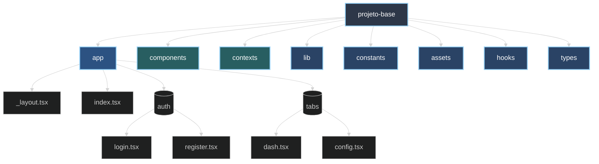
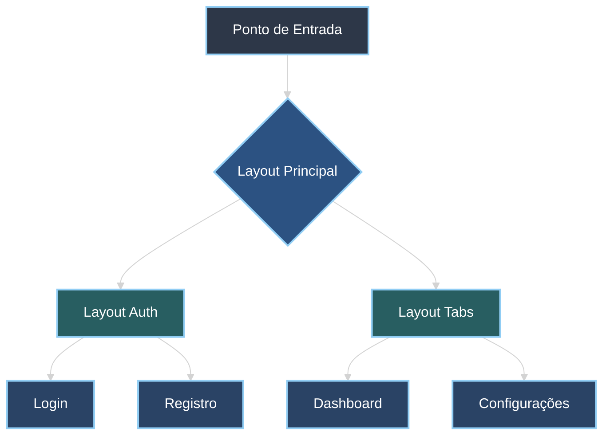
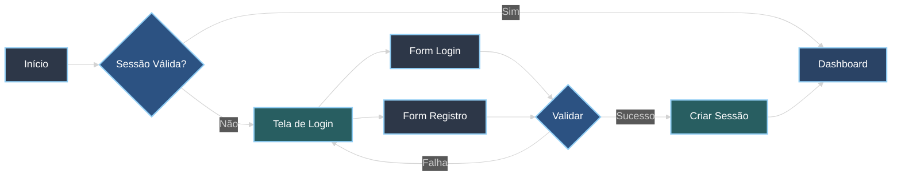
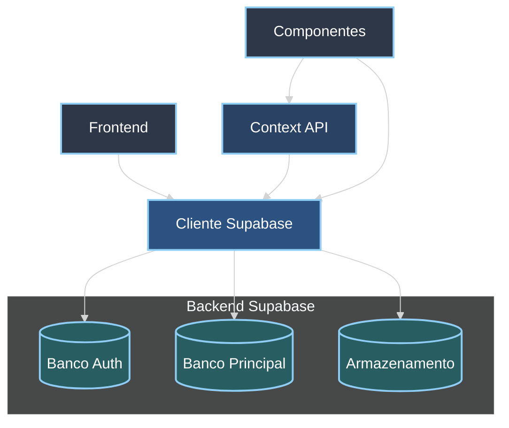
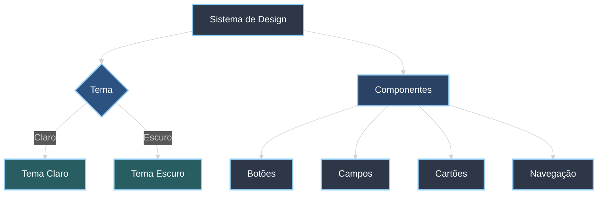
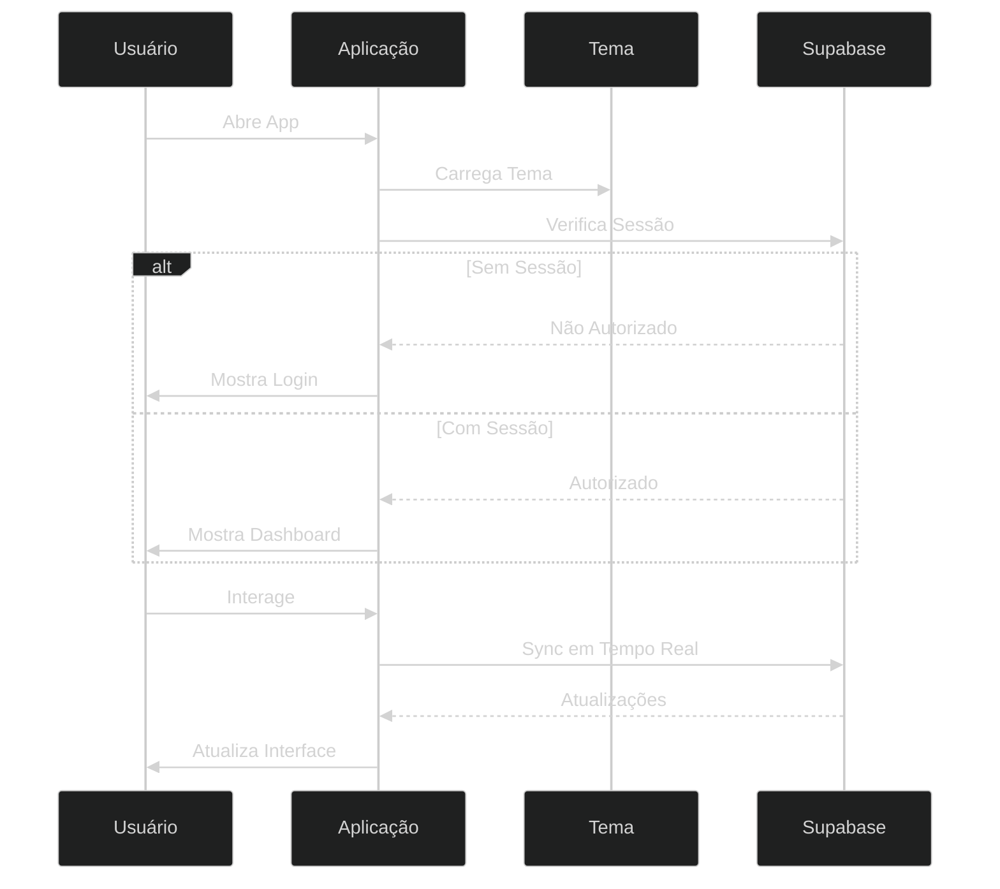
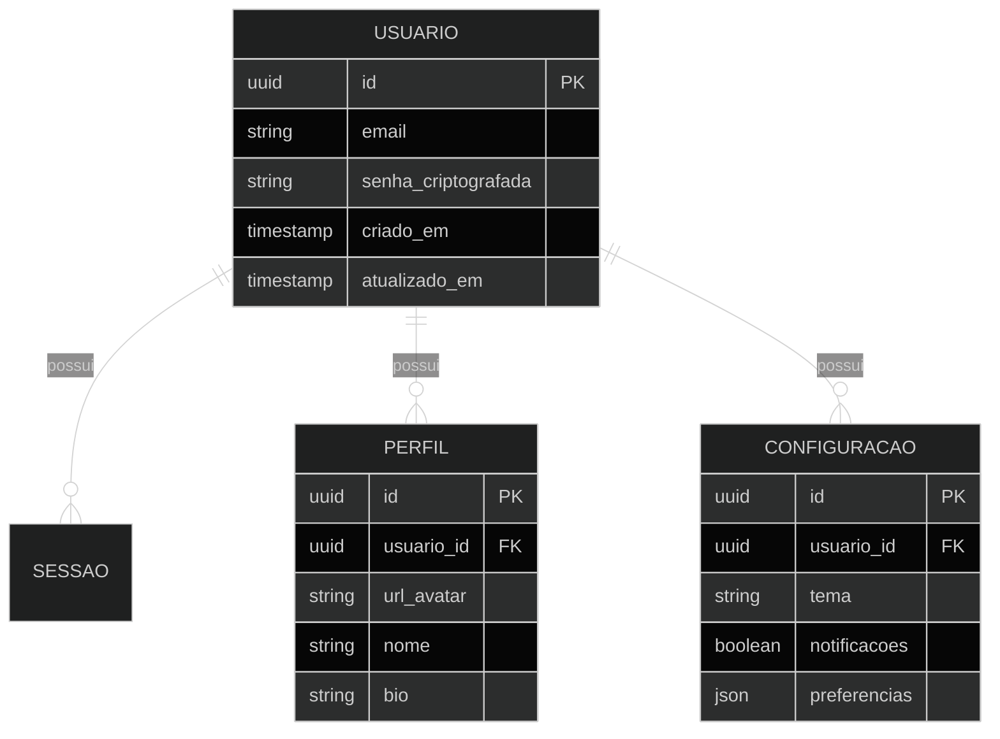
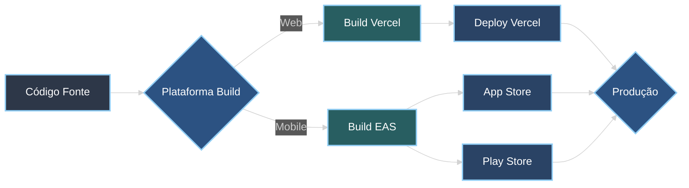

# 🔄 Fluxo do Projeto Base

## 0. Estrutura de Arquivos

### Descrição dos Diretórios
| Diretório    | Função |
|--------------|--------|
| 📱 `app/`      | Rotas e páginas usando Expo Router |
| 🧩 `components/`| Componentes React reutilizáveis |
| 🔄 `contexts/` | Contextos globais (Auth, Theme) |
| 📚 `lib/`      | Configurações (Supabase, etc) |
| 🎨 `constants/`| Design System e constantes |
| 🖼️ `assets/`   | Imagens, fontes e recursos |
| 🎣 `hooks/`    | Hooks personalizados |
| 📝 `types/`    | Tipagens TypeScript |

### Arquivos Principais
| Arquivo | Função |
|---------|--------|
| `app/_layout.tsx` | Layout principal e providers |
| `app/index.tsx` | Redirecionamento inicial |
| `app/(auth)/login.tsx` | Tela de login |
| `app/(auth)/register.tsx` | Tela de cadastro |
| `app/(tabs)/dash.tsx` | Dashboard principal |
| `app/(tabs)/config.tsx` | Configurações do app |

## 1. Estrutura de Navegação

## 2. Fluxo de Autenticação

## 3. Arquitetura de Dados

## 4. Sistema de Design

## 5. Ciclo de Vida da Aplicação

## 6. Modelo de Dados

## 7. Fluxo de Deploy

